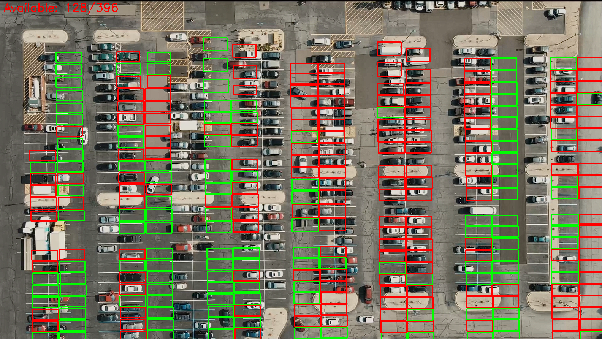

# Parking Spot Detection System



## Overview

This application provides accurate parking spot detection using a combination of computer vision and machine learning. The system requires:

1. An image of a parking lot
2. A corresponding mask image where parking spots are marked in white

The system then identifies available and occupied parking spots, displaying the results visually.

## Features

-  **Accurate detection** using custom mask images
-  **Web interface** for easy uploading and processing
-  **Real-time results** showing available spots
-  **Simple mask creation** process

## Prerequisites

- Python 3.8+
- OpenCV
- scikit-image
- Flask
- scikit-learn

## Installation

1. Clone the repository:
   ```bash
   git clone https://github.com/4444Harsh/Parking_lot_Area.git
   cd parking-system
   ```

2. Create and activate a virtual environment:
   ```bash
   python -m venv .venv
   source .venv/bin/activate  # Linux/Mac
   .venv\Scripts\activate     # Windows
   ```

3. Install dependencies:
   ```bash
   pip install -r requirements.txt
   ```

## How to Use

### 1. Preparing Mask Images

Create mask images for your parking lots:
1. Open the parking lot image in an image editor
2. Paint all parking spots pure white (RGB 255,255,255)
3. Paint all non-parking areas black (RGB 0,0,0)
4. Save as PNG file

Example:
| Parking Lot | Mask Image |
|-------------|------------|
|  |  |

### 2. Running the Application

```bash
python app.py
```

Access the web interface at: `http://localhost:5000`

### 3. Using the Web Interface

1. Upload a parking lot image
2. Upload its corresponding mask image
3. Click "Process Images"
4. View the results showing available (green) and occupied (red) spots

## File Structure

```
parking-system/
├── static/
│   ├── masks/          # Predefined mask images
│   ├── uploads/        # User uploaded images
│   └── results/        # Processed results
├── templates/
│   └── index.html      # Frontend
├── parking_detector.py # Detection logic
├── app.py              # Flask backend
├── model.p             # Pretrained model
└── README.md
```

## Troubleshooting

- **Error processing images**: Ensure your mask image has:
  - Pure white (255,255,255) parking spots
  - Pure black (0,0,0) non-parking areas
  - Same dimensions as the parking lot image

- **Model not loading**: Verify `model.p` exists in the root directory

## Sample Data

Sample images are provided in:
- `static/uploads/parking_image_test.png` - Example parking lot
- `static/masks/mask_1920_1080.png` - Corresponding mask

---

For questions or support, please contact [guptaharshbly@gmail.com].
